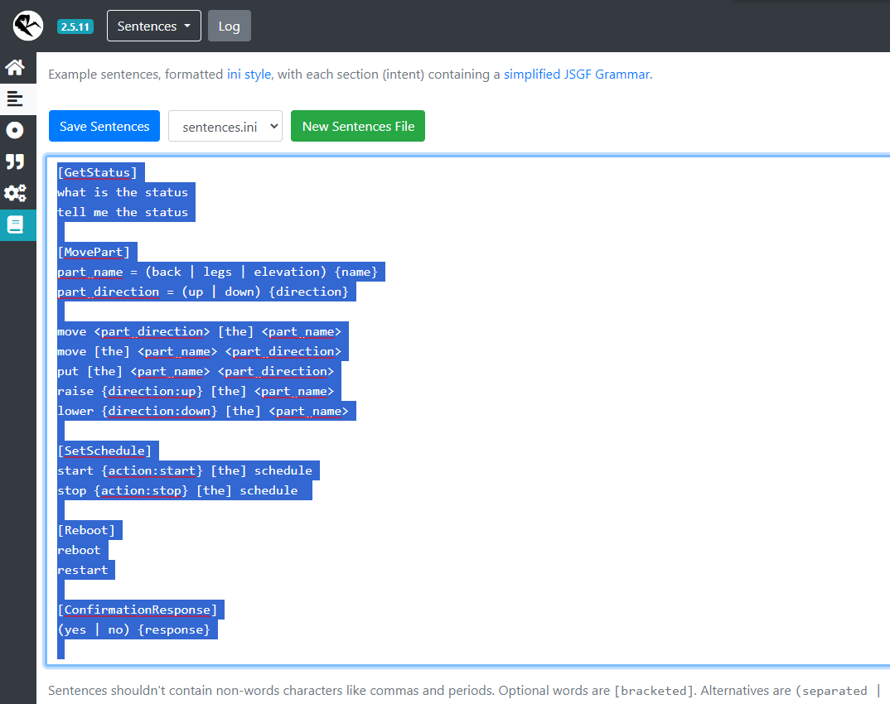

# Sandman

Sandman relies on [Rhasspy](https://rhasspy.readthedocs.io) to provide voice control and auditory feedback. Unfortunately, Rhasspy does not work on a Raspberry Pi 5, it must be used with a 4. In addition, it is not being actively maintained, so it will be up replaced with something else in the future. The following information will help with setting up Rhasspy, which should be done prior to running Sandman.

## Docker

Rhasspy will be installed using Docker. Theoretically Docker Desktop will be fine, but if you don't want that you can install Docker using the following steps:

```bash
curl -sSL https://get.docker.com | sh
```

Then you must add your user to the docker group.

```bash
sudo usermod -a -G docker $USER
```

You MUST reboot after adding your user to the docker group!

## Rhasspy

Follow these instructions in order to install Rhasspy on your Raspberry Pi:

```bash
cd ~/sandman_main/rhasspy
```
```bash
docker compose up -d
```

Once Rhasspy is running, it can be configured through its web interface by going to YOUR_SANDMAN_IP_ADDRESS:12101. 

### Settings

If you click on the icon which looks like a set of gears, you should see an interface that looks something like the following, although the settings may be different:


It is recommended that you set all of the settings to the same thing as pictured above, but you may use whichever text to speech option you like. You can also choose whichever wake word you prefer under Wake Word. When you're done, click on the Save Settings button. Please note that you may have to do this iteratively, and you may be asked to download data for some of the settings. A download button should appear at the top of the page like below if additional data is needed.


You will also have to fill out the device information underneath the Audio Recording and Audio Playing settings. Click the green colored area with the caret to the left to expose the microphone/Audio Recording or speaker/Audio Playing settings. Once expanded you will want to click the refresh button on the right side of the page then you'll need to select the correct available device for the microphone and speaker from the dropdown. For instance the audio recording device might be "Default Audio Device (sysdefault:CARD=Device_1)" and the audio playing device might be "Default Audio Device (sysdefault:CARD=Device)". It might be helpful to plug in one device at a time, refresh the device list, then review which device(s) have been added to the list. The device list may be long so this may take some trial and error while testing as described below.


You can test the audio recording and playback on home page for Rhasspy aka the house button on the left navigation bar. On the home page put some test text into the text field next to the Speak button and then press the Speak button to test the speaker. If this doesn't produce any sound or if an except/error pops up return to the previous settings page and try selecting a different playback device until successful. You may also want to adjust the volume at this point. 1 is the max volume. With the speaker working click the yellow Wake Up button on the home page then speak into the microphone. Now you can click the green Play Recording button to hear what was captured by the microphone. If the microphone isn't working then you likely will see a message in red saying "No intent recognized" appear after the "Listening for command" popup closes. You'll need to select a different device under the Audio Recording setting and repeat the test.


### Sentences

Sentences are the grammar which dictates the conversations you can have. If you click the sideways looking bar graph icon, you will see the following interface, although the highlighted text may be different.



No need to type all of this out! You can copy the sentences from [here](sandman_sentences.txt) and replace the default sentences. Then you will need to click the button that says Save Sentences. This should cause the grammar to be generated.

### Wake Sounds

If you would like to change the wake sounds, you can use the provided sounds or use your own by first copying them into the configuration location like this:

```bash
mkdir ~/.config/rhasspy/profiles/en/wav
```
```bash
cp ~/sandman_main/rhasspy/audio/* ~/.config/rhasspy/profiles/en/wav/
```

You can find the sound setting by clicking on the icon that looks like a set of gears and scrolling down. It looks like the following image:


Then you can replace each path with the following:

```bash
${RHASSPY_PROFILE_DIR}/wav/beep-up.wav
${RHASSPY_PROFILE_DIR}/wav/beep-down.wav
${RHASSPY_PROFILE_DIR}/wav/beep-error.wav
```

Click Save Settings and it should start using the new sounds.
